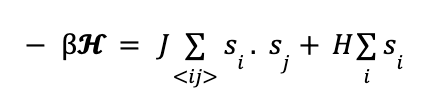

# Ising-Model-Simulation
AP CS A final project. The project is based on the simulation of a d=1 Ising model with spin values +-1. 

# The Ising Model

Just like any other mathematical model, the Ising model is a model constructed to conveniently investigate real-world behavior of different systems. These real-world situations could range from the thermodynamic analysis of water to the analysis of a quantum electrodynamic system, or even to the investigation of a biological system.

The Ising model is a relatively simple model, consisting of sites, generally called “spins”, that can take a variety of values depending on the definition of the system. The simplest version of the Ising model is the one where the spins can take one of the two values: -1 or +1. In technical terms, this refers to the fact that each spin i has the value si (sometimes shown as 𝞂i) that can be either -1 or +1. These sites are arranged in a lattice configuration that have d dimensions, and d=1 generates the simplest Ising model system, a string of spins.

  

However, the Ising model does not govern systems with all numbers of sites, it specifically requires the site number to be infinite which is the most important feature of the model that allows the system to be solved, either definitely or via approximations. Therefore, i=1,2,3, ... , N where N tends to infinity. 

Alongside these, the Ising model is not bounded by the fact that si= ±1. si can take a variety of values, discrete or continuous as in Heisenberg models or spin glasses.

Although the Ising model possesses aspects regarding many macroscopic values, the main component of every system is the total energy of the system and how it is calculated. In the Ising model, depending on how many types of interactions or individual factors the model has, the Hamiltonian can be written as such, in the most basic form:

Similarly, a statistical concept that will be useful in the future sections is the partition function, given by Z. The partition function is defined as:

